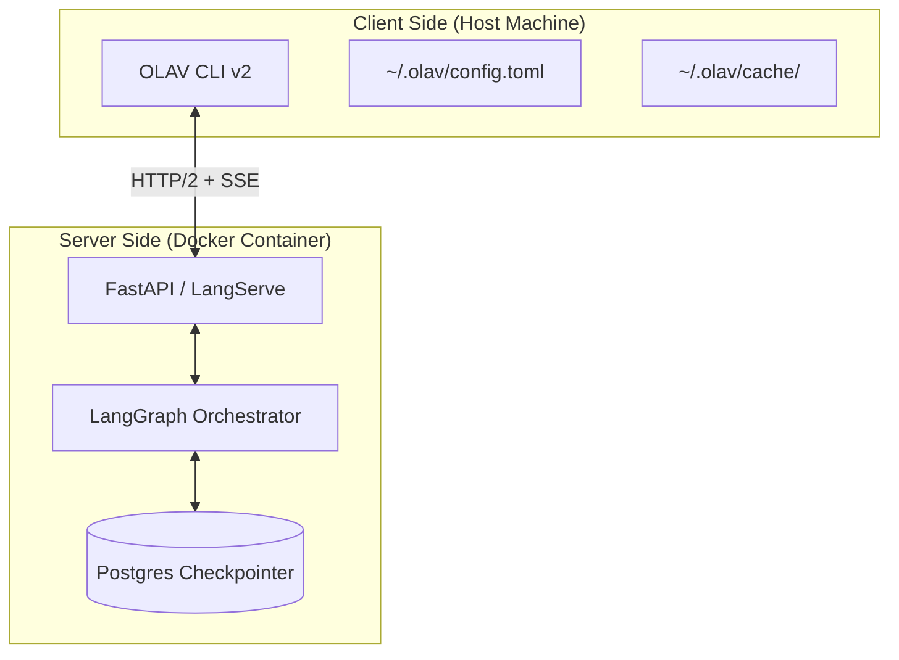

# OLAV CLI v2 Architecture Design

## 1. Executive Summary

OLAV CLI v2 represents a paradigm shift from a "Local Execution" model to a "Thin Client" model. It is designed to be the primary interface for the OLAV platform, providing a professional-grade, terminal-based user experience (TUI) that rivals modern DevOps tools like `k9s` or `gh`.

**Core Philosophy:**
*   **Thin Client**: Zero business logic on the client. All reasoning happens in the containerized Orchestrator.
*   **Stateful Experience**: The CLI maintains a persistent connection to the session state, allowing seamless resumption.
*   **Rich Interactivity**: Leveraging `Rich` and `Prompt Toolkit` for a modern, visual terminal experience.

## 2. System Architecture



### 2.1 Communication Protocol
*   **Transport**: HTTP/2 (via `httpx`) for multiplexing and performance.
*   **Streaming**: Server-Sent Events (SSE) for real-time token streaming and "Thinking Process" updates.
*   **Authentication**: Bearer Token (JWT) stored locally.

## 3. Component Design

### 3.1 The REPL Loop (`olav.cli.repl`)
The core of the interactive mode is a Read-Eval-Print Loop built with `prompt_toolkit`.

*   **Input**:
    *   Multi-line editing support.
    *   Syntax highlighting for SQL, Python, and JSON inputs.
    *   **Auto-completion**:
        *   Commands (`/help`, `/mode`)
        *   Dynamic resources (Device names, SuzieQ tables) fetched from API.
*   **Key Bindings**:
    *   `Ctrl+Space`: Trigger auto-completion.
    *   `Ctrl+R`: Fuzzy search command history.
    *   `Alt+Enter`: Submit multi-line input.

### 3.2 The Display Engine (`olav.cli.display`)
Responsible for rendering complex data structures using `Rich`.

*   **Thinking Tree**: A live-updating tree view showing the Agent's reasoning steps and tool calls.
    ```text
    🧠 Analyzing BGP State...
    ├── ⏳ Querying SuzieQ (table='bgp', state='NotEstablished')... ✅ (0.5s)
    ├── ⏳ Checking Interface Counters (R1, R2)... 
    └── 📝 Formulating hypothesis...
    ```
*   **Data Renderers**:
    *   **Tables**: Auto-formatted tables for structured data (SuzieQ results).
    *   **Markdown**: Rendering LLM responses with syntax highlighting.
    *   **JSON/YAML**: Syntax-highlighted raw data views.

### 3.3 The Client SDK (`olav.cli.client`)
A clean, typed Python SDK that wraps the API calls.

```python
class OlavClient:
    async def chat_stream(self, message: str, thread_id: str) -> AsyncIterator[StreamEvent]:
        ...
    
    async def upload_document(self, file: Path) -> Document:
        ...
        
    async def list_devices(self) -> List[Device]:
        ...
```

## 4. Human-Computer Interaction (HCI) Design

This section details how the CLI handles specific workflows and user interactions.

### 4.1 Standard Mode (The "Chat" Experience)
The default interaction mode. Focuses on speed and clarity.

*   **Input**: User types natural language queries.
*   **Process Visualization**:
    *   Uses a **collapsible "Thinking Tree"** (via `Rich.Live`).
    *   Shows tool calls in real-time (e.g., `🔧 Querying SuzieQ...`).
    *   Streaming text output appears immediately as tokens arrive.
*   **Output**:
    *   Final answer rendered in Markdown.
    *   Data tables (e.g., BGP neighbors) are auto-formatted.
    *   Citations/Sources are linked at the bottom.

### 4.2 Expert Mode (Deep Dive)
Activated via `/mode expert` or `olav -e`. Designed for complex troubleshooting.

*   **Task Decomposition View**:
    *   Before execution, the CLI displays the **Todo List** generated by the Planner.
    *   ```text
        📋 Execution Plan:
        [ ] 1. Audit BGP configuration on Edge Routers
        [ ] 2. Check interface errors on core links
        [ ] 3. Analyze route table consistency
        ```
*   **Recursive Execution**:
    *   Nested steps are indented in the Thinking Tree.
    *   Sub-agents (e.g., `SuzieQAnalyzer`) have distinct icons/colors.
*   **Progress Tracking**:
    *   Checkboxes update in real-time (`[ ]` -> `[x]`).

### 4.3 Inspection Mode
Dedicated mode for automated health checks.

*   **Selection**: `olav inspect list` shows available profiles from `config/inspections/*.yaml`.
*   **Execution**: `olav inspect run <profile>`
    *   Displays a **Global Progress Bar** (Total Checks).
    *   Displays a **Device Progress Bar** (Current Batch).
*   **Reporting**:
    *   Summary table printed to stdout (Pass/Fail/Warning counts).
    *   Full report generated as Markdown/HTML and saved locally.
    *   "View Report" command to open in default pager/browser.

### 4.4 Inspection Configuration
Management of inspection profiles via CLI.

*   **List**: `olav inspect profiles` lists all available YAML profiles with descriptions.
*   **Show**: `olav inspect show <profile>` renders the YAML config with syntax highlighting.
*   **Validate**: `olav inspect validate <file>` checks local YAML against the schema before uploading.

### 4.5 RAG Document Management
Managing the knowledge base.

*   **Upload**: `olav doc upload <path>`
    *   Shows upload progress bar.
    *   Shows indexing status (Vectorization progress).
*   **Search**: `olav doc search <query>`
    *   Returns ranked results with "Relevance Score".
    *   Highlights matching snippets.
*   **List**: `olav doc list` shows indexed documents with metadata (size, date).

### 4.6 HITL (Human-in-the-Loop)
Safety mechanism for high-risk operations (Write/Config changes).

*   **Trigger**: When the Agent proposes a write operation (e.g., `netconf_edit_config`).
*   **UI Interruption**:
    *   The Thinking Tree pauses.
    *   A **Warning Panel** appears (Red/Yellow border).
    *   Displays:
        *   **Risk Level**: High/Medium
        *   **Operation**: `interface shutdown`
        *   **Target**: `Device R1`
        *   **Reasoning**: Why the agent wants to do this.
*   **Interaction**:
    *   `[Y]es`: Approve and continue.
    *   `[N]o`: Reject (Agent handles rejection error).
    *   `[M]odify`: User types natural language instruction to adjust the plan (e.g., "Don't shut down, just clear counters").

## 5. Command Structure

The CLI uses `Typer` for command parsing.

| Command | Description |
| :--- | :--- |
| `olav` | Enter interactive REPL mode (Default) |
| `olav query <text>` | Execute a single query and exit |
| `olav inspect <profile>` | Run a network inspection |
| `olav session list` | List active conversation threads |
| `olav session resume <id>` | Resume a specific session |
| `olav config` | Manage CLI configuration |
| `olav login` | Authenticate with the server |

## 6. Configuration Management

Configuration is stored in `~/.olav/config.toml`:

```toml
[server]
url = "http://localhost:8000"
timeout = 30

[ui]
theme = "monokai"
show_timestamps = true
nerd_fonts = true

[auth]
# Authentication is currently deferred for testing
# token = "..."
```

## 7. Implementation Roadmap

### Phase 1: Core Client (Week 1) ✅ COMPLETED
- [x] Implement `OlavThinClient` with `httpx` (HTTP/2 + SSE support).
- [x] Implement basic `olav query` command.
- [x] Implement streaming response parsing (SSE parser with event types).
- [x] Unit tests: 23/23 passing.

### Phase 2: Interactive REPL (Week 2) ✅ COMPLETED
- [x] Integrate `prompt_toolkit` with FileHistory, AutoSuggest.
- [x] Implement `ThinkingTree` visualization.
- [x] Implement session management with `/session` command.
- [x] REPL commands: `/help`, `/mode`, `/clear`, `/history`, `/session`, `/exit`.
- [x] CLI → API integration tested (auth bypass for dev mode).
- [x] Infrastructure init via `--init` flag (replaces Docker init container).
- [x] Full init with NetBox via `--init --full` flag.

### Phase 3: Advanced Features (Week 3) ✅ COMPLETED
- [x] Auto-completion for device names (DynamicDeviceCompleter with cache TTL).
- [x] Auto-completion for SuzieQ tables (via /autocomplete/tables endpoint).
- [x] File upload progress bars (on_progress callback in upload_document).
- [x] "Dashboard" mode (TUI) with colorful OLAV logo and snowman ASCII art.
- [x] Welcome banner on REPL startup.
- [x] `olav dashboard` command for full-screen TUI.
- [x] `olav banner` command to show ASCII art.
- [x] Unit tests: 46/46 passing.

## 8. Security Considerations
*   **Authentication**:
    *   **Development Mode**: Set `AUTH_DISABLED=true` in environment to bypass authentication (enabled in docker-compose.yml for testing).
    *   **Production Mode**: Bearer Token (JWT) stored in `~/.olav/config.toml` with 600 permissions.
*   **TLS**: Client enforces HTTPS by default (can be overridden for localhost).
*   **Input Validation**: All inputs are sanitized on the server side.
